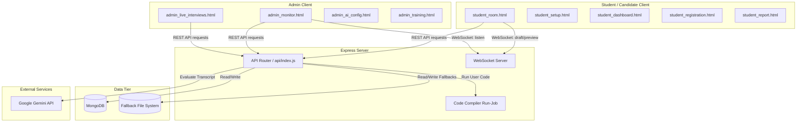

# Codebase Analysis: AI Interview Application

This document provides a thorough structural and architectural analysis of the AI Mock Interview application. The platform is designed to conduct automated and admin-supervised candidate interviews using web speech APIs, real-time WebSockets, PeerJS, and Gemini AI.

---

## 1. Architectural Overview

The application is structured as a single-node Express backend serving static HTML pages and API routes, combined with a WebSocket server for real-time signaling.

### High-Level Architecture Diagram


---

## 2. File Directory Breakdown

```
2 ai mock/
├── .dockerignore
├── .env.local                  # Local environment settings (GEMINI_API_KEY, ADMIN_PASSWORD, etc.)
├── .gitignore
├── Dockerfile                  # Container definition for App server
├── docker-compose.yml          # Container configuration for MongoDB & App
├── package.json                # Project dependencies (dotenv, express, mongodb, ws, @google/genai)
├── package-lock.json
├── index.html                  # Landing page (Features overview & entrance gates)
├── admin.css                   # Stylesheet for the Admin interface
├── student.css                 # Stylesheet for the Student interface
│
├── server/
│   └── index.js                # Core Express app, WebSocket handlers, and MongoDB controllers
│
├── api/
│   └── index.js                # Vercel entrypoint delegating requests to server/index.js
│
├── db/
│   ├── init-mongo.js           # Database initialization script (collections & index setup)
│   ├── fallback-entrances.json # Local fallback JSON storage for candidate registrations
│   ├── fallback-sessions.json  # Local fallback JSON storage for interview state data
│   ├── fallback-aiconfig.json  # Local fallback JSON storage for AI prompt instructions
│   └── previews/               # Dir storing static webcam/screen captures (base64 writes)
│
├── admin_login.html            # Admin login page
├── admin_live_interviews.html  # Dashboard listing active & completed sessions
├── admin_monitor.html          # Interactive control room (live feeds, draft sync, chat takeover)
├── admin_students.html         # Candidate registry with filter, search, and report portals
├── admin_ai_config.html        # Console for editing global AI instructions
├── admin_audit_logs.html       # Compliance tracker showing start/takeover/complete events
├── admin_training.html         # Portal to register supervised rubric corrections
│
├── student_registration.html   # Student signup page (USN, Branch, College, Year)
├── student_dashboard.html      # Landing dashboard showing student history, stats & starting actions
├── student_introduction.html   # Round selection (Introduction, Aptitude, Technical, HR)
├── student_setup.html          # Media system check page (Permissions check for cam/mic)
├── student_room.html           # Live interview dashboard (speech-to-text, TTS synthesis, WebSockets)
├── student_report.html         # Custom scorecard (scores, strengths, improvements)
└── student_leaderboard.html    # Leaderboard displaying rankings of top scorers
```

---

## 3. Database Schema & Fallback Model

The app is built on a **dual-database design**. If MongoDB is unreachable (e.g., in standalone offline setups), the backend switches to a local file-based database (`fallback-*.json`).

### Collections and Fields

#### 1. `interviewsessions` (Fallback: `fallback-sessions.json`)
Saves the state of candidate mock sessions.
```typescript
interface InterviewSession {
  _id?: ObjectId;
  sessionId: string;          // Randomized token
  mode: 'ai' | 'admin';       // Controls takeover mode
  adminMessage: string | null;// Admin takeover message to speak
  studentAnswer: string | null;// Real-time answer draft / submission
  studentName: string;        // E.g., John Doe
  usn: string;                // University Seat Number (Case-insensitive)
  college: string;
  branch: string;
  year: string;
  status: 'in_progress' | 'completed';
  aiStatus: 'active' | 'paused';
  startTime: Date;
  updatedAt: Date;
  completedAt?: Date;
  transcript: Array<{ role: 'ai' | 'student' | 'admin', text: string }>;
  improvements?: Array<string>; // Training corrections submitted by admins
  score?: number;             // Generated by Gemini (0-100)
  feedback?: string;          // Overall feedback text
  strengths?: string[];
}
```

#### 2. `aiconfigs` (Fallback: `fallback-aiconfig.json`)
Stores prompt directives given to Gemini.
*   `instructions`: Markdown instructions string.

#### 3. `entrances` (Fallback: `fallback-entrances.json`)
Legacy collection retained for backward-compatibility.
*   `name`, `branch`, `field`, `createdAt`.

---

## 4. API Specification

| Endpoint | Method | Auth | Description |
| :--- | :--- | :--- | :--- |
| `/api/admin/login` | `POST` | None | Verifies credentials; yields HttpOnly `admin_auth` cookie. |
| `/api/admin/logout` | `POST` | None | Expires the admin cookie. |
| `/api/admin/sessions` | `GET` | Admin | Fetches all session logs. |
| `/api/admin/ai-config` | `GET` | Admin | Retrieves Gemini instructions. |
| `/api/admin/ai-config` | `POST` | Admin | Updates instructions. |
| `/api/admin/training-feedback` | `POST` | Admin | Inserts a training correction note for the specified session. |
| `/api/student/register` | `POST` | None | registers candidate & returns a unique `sessionId`. |
| `/api/student/sessions` | `GET` | None | Returns completed session histories for a given candidate's USN. |
| `/api/interview/start` | `POST` | None | Yields the first question based on selected round (`QUESTIONS_BY_ROUND`). |
| `/api/interview/answer` | `POST` | None | Analyzes answer index and responds with subsequent question or completion message. |
| `/api/interview/sync` | `GET` | None | Retrieves live details of a session. |
| `/api/interview/sync` | `POST` | None | Updates current status parameters (Takeover status, messages, mode). |
| `/api/leaderboard` | `GET` | None | Lists top 20 best scorers. |
| `/api/interview/complete` | `POST` | None | Submits the transcript to Gemini 2.5 Flash for evaluation and scores. |
| `/api/compile` | `POST` | None | Submits code (Python, Javascript, C, C++, Java) to be executed on host. |
| `/api/preview/:id` | `GET` | None | Retrieves latest webcam/screen capture snapshot. |
| `/api/preview/:id` | `POST` | None | Uploads a base64 webcam/screen capture snapshot. |

---

## 5. Real-Time Synchronization & Streaming

### WebSocket Signaling (`/ws`)
A single WebSocket server handles real-time coordination between candidate rooms and observing admins:

```
                  +--------------------------------+
                  |         WebSocket Server       |
                  +--------------------------------+
                     ^                           ^
     [register candidate]                     [register admin]
                     |                           |
            (Student Client)               (Admin Client)
                     |                           |
        [preview: base64 img] -------------------> [forward preview]
        [draft: live transcript] ---------------> [forward draft]
```

1.  **Registration**:
    *   `register` message: `{ type: 'register', role: 'candidate' | 'admin', id: sessionId }`
2.  **Webcam & Screen Previews**:
    *   `preview` message: `{ type: 'preview', previewType: 'cam' | 'screen', image: 'data:image/jpeg;base64,...' }`
    *   Forwarded directly to registered admin sockets.
3.  **Draft Text Matching**:
    *   `draft` message: `{ type: 'draft', text: string }`
    *   Transmits live speech recognition fragments to the admin monitor for real-time review.

### PeerJS Video & Screen Sharing
*   Provides WebRTC peer connection signalling.
*   **Student Side**: Registers peer as `student-${sessionId}` and answers calls by passing their `localStream`. Also calls the admin as `admin-${sessionId}` when screen-sharing is toggled to push the video track.
*   **Admin Side**: Registers peer as `admin-${sessionId}` and calls `student-${sessionId}` on load to hook up webcam feeds. Also listens to incoming calls to attach screen-sharing tracks.

---

## 6. Frontend Core Mechanics

### 1. Speech Recognition & Auto-Submission (`student_room.html`)
*   Uses `window.webkitSpeechRecognition` for translating spoken answers.
*   Incorporates **4-second silence detection**: a timer (`silenceTimer`) is reset every time new text matches. If no new words are detected for 4 seconds, `handleAutoSubmit()` runs automatically, pushing the text to `/api/interview/answer`.
*   Includes a text box fallback if Speech Recognition permissions fail.

### 2. Audio Speech Synthesis (TTS)
*   Translates questions into audio using `SpeechSynthesisUtterance`.
*   Enforces a strict lifecycle: candidate microphone is muted/paused during speech synthesis, and recognition restarts automatically (`startListening()`) only when `utterance.onend` fires.

### 3. Takeover Mechanics
*   The student page polls `/api/interview/sync` every 3 seconds.
*   If `mode === 'admin'`, automated question paths are paused. The page waits for `adminMessage` updates, which are dynamically spoken via TTS and logged into the candidate's transcript bubble container.

---

## 7. Security & Engineering Recommendations

1.  **PeerJS Broker Server Configuration**:
    *   *Current*: Instantiates `new Peer()` without options, defaulting to public `0.peerjs.com` cloud servers.
    *   *Improvement*: Spin up a private local/cloud PeerJS broker server and pass `host`/`port` settings to ensure stability and isolate media signaling.
2.  **Code Compilation Sandboxing**:
    *   *Current*: The `/api/compile` route runs shell compilers directly on the host operating system via `child_process.execFile` (e.g. `gcc`, `java`, `python`).
    *   *Improvement*: This poses a high-risk security hazard (arbitrary code execution). Implement containerized sandboxing (e.g., using Docker or a secure sandbox library like `isolate`) to run candidate code safely.
3.  **Authentication Guarding**:
    *   *Current*: Admin cookie checks use a basic substring match on cookie header (`admin_auth=authenticated`).
    *   *Improvement*: Apply JWTs or cryptographically signed session tokens for secure validation.
    *   *Security Note*: Standard HttpOnly cookies are used but checking is done via primitive text splits, which is secure enough but could be streamlined.
4.  **WebSocket Reconnection**:
    *   *Current*: Basic timeout-based retry on socket close.
    *   *Improvement*: Add exponential backoff to WebSocket reconnects to prevent network overhead during connection loss.
