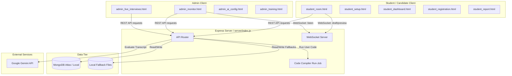

# Codebase Analysis: AI Mock Interview Application

This document provides a comprehensive structural, architectural, and mechanical analysis of the AI Mock Interview system. The platform combines web speech APIs, real-time WebSockets, WebRTC (PeerJS), and Google Gemini AI to deliver an automated, adaptive, and optionally supervised candidate assessment platform.

---

## 1. Architectural Overview

The application is built using a client-server architecture. It features a single-node Express backend serving static HTML frontends and handling REST/WebSocket channels, backed by a persistent MongoDB database (or local JSON file storage as a failover).

### Core Architecture & Communication Flow


---

## 2. Directory Structure

```
2 ai mock/
├── .dockerignore
├── .env.local                  # Environment credentials (API keys, ports, Mongo URI)
├── .gitignore
├── Dockerfile                  # Containerization template for Node server
├── docker-compose.yml          # Container stack for MongoDB service & application
├── package.json                # Project dependencies (Express, MongoDB driver, WS, Gemini SDK)
├── package-lock.json
├── index.html                  # Main landing portal and gateway selector
├── admin.css                   # Admin dashboard stylesheets
├── student.css                 # Student UI styling (glassmorphism tokens)
│
├── server/
│   └── index.js                # Main Express routes, WebSockets signaling, and controllers
│
├── api/
│   └── index.js                # Vercel endpoint re-exporting server/index.js
│
├── db/
│   ├── init-mongo.js           # Database collections initialization script
│   ├── fallback-entrances.json # Local fallback JSON storage: registrations
│   ├── fallback-sessions.json  # Local fallback JSON storage: active sessions
│   ├── fallback-aiconfig.json  # Local fallback JSON storage: AI instruction prompts
│   └── previews/               # Dir storing static base64 candidate feed frames
│
├── admin_login.html            # Credentials gateway for admin panel
├── admin_live_interviews.html  # Monitors overview: currently active & completed interviews
├── admin_monitor.html          # Takeover room: live streams, draft sync, chat control, metrics
├── admin_students.html         # Candidate registry with filter, search, and report portals
├── admin_ai_config.html        # Console for configuring global AI instructions
├── admin_audit_logs.html       # Auditing log portal for monitoring events
├── admin_training.html         # Portal to feed feedback/corrections to the AI evaluator
│
├── student_registration.html   # Student signup page (USN, Branch, College, Year)
├── student_dashboard.html      # Landing dashboard showing student history, stats & starting actions
├── student_introduction.html   # Assessment round selection (Technical, HR, Aptitude, Intro)
├── student_setup.html          # Camera, Mic pre-check, and voice calibration page
├── student_room.html           # Live interview room (speech-to-text, audio TTS, code sandbox)
├── student_report.html         # Grade scorecard (overall rating, strengths, weaknesses, metrics)
└── student_leaderboard.html    # Leaderboard displaying rankings of top scorers
```

---

## 3. Database Schema & Fallback System

The system operates on a **dual-database design**. If MongoDB is unreachable, it automatically triggers a local, file-based database fallback (`db/fallback-*.json`) to prevent system crashes.

### Principal Data Structures

#### 1. `interviewsessions` (Fallback: `fallback-sessions.json`)
Tracks the current state, metadata, transcripts, and evaluation scorecards for mock interviews.
```typescript
interface InterviewSession {
  _id?: ObjectId;
  sessionId: string;             // Unique candidate token
  mode: 'ai' | 'admin';          // active mode (admin represents takeover mode)
  adminMessage: string | null;   // Admin message queued to speak
  studentAnswer: string | null;  // Real-time answer draft/final
  studentName: string;
  usn: string;                   // Candidate ID USN (Unique string)
  college: string;
  branch: string;
  year: string;
  status: 'in_progress' | 'completed';
  aiStatus: 'active' | 'paused';
  startTime: Date;
  updatedAt: Date;
  completedAt?: Date;
  transcript: Array<{ role: 'ai' | 'student' | 'admin', text: string }>;
  improvements?: Array<string>;  // Admin training adjustments
  score?: number;                // Final Gemini score (0-100)
  feedback?: string;             // Detailed Gemini evaluation feedback
  strengths?: string[];          // Top candidate strengths
  vallyMetrics?: {               // Behavior metrics average
    confidence: number;
    vocabulary: number;
    answering: number;
    nervousness: number;
    faceExpression: number;
    questionUnderstand: number;
  };
}
```

#### 2. `aiconfigs` (Fallback: `fallback-aiconfig.json`)
Saves system-level prompts and behavior rubrics passed to the Gemini API.

#### 3. `interviewquestions` (Fallback: `fallback-questions.json`)
Contains the list of questions segmented by interview round type (`Basic Introduction`, `Aptitude Round`, `Technical Round`, `HR Round`).

---

## 4. Mechanical Implementations & Recent Upgrades

### 1. Voice Recognition & Precheck Calibration (`student_setup.html`)
To prevent microphone mismatches or quiet input issues inside the interview room, a voice calibration step has been added to the setup sequence:
*   **10-Word Calibration Phrase:** Candidates are prompted to speak exactly: `"My microphone is working and I am ready to start"`.
*   **Visual Calibration Waveform:** Highly styled divs act as a live mic visualizer using keyframed CSS pulses when SpeechRecognition captures volume activity.
*   **Live Feedback:** A transcript box shows exactly what the Speech Recognition API is hearing.
*   **Flexible Matching Engine:** If the Web Speech API recognizes the keywords (`microphone`, `working`, `ready`, `start`) or registers a total phrase length of 7+ words, it completes the check. It also contains manual override skip options for accessibility and browser compatibility.

### 2. Audio Speech Synthesis (TTS) & State Controller (`student_room.html`)
*   **Reliable State Machine:** Cleaned up browser-level hangs by replacing `window.speechSynthesis.speaking` checks with our internal `isAIActive` state machine tracking.
*   **Chrome/Edge Speech Synthesis Hang Mitigation:** Modified speech synthesis callbacks to pass `force = true` on `onend`, `onerror`, and `onboundary` timeouts. This bypasses browser-level speech synthesis loops and forces the room to transition to active listening.

### 3. Transcript Normalization (`cleanTTSBleed`)
*   **Eco/Bleed Filter Optimization:** Web Speech API captures audio bleed if speakers are active. The `cleanTTSBleed` filter washes out question segments from candidate transcriptions.
*   **Short Response Safeguard:** Refactored the cleanup matching algorithm to *only* clean transcripts if they exactly match a long question (length > 3 words) or contain a full question phrase. This prevents short student responses (like "Yes", "Java", "SQL") from being stripped out.

### 4. Background Scorecard Evaluations (`server/index.js` & `student_room.html`)
*   **Instant Exit Redirect:** When the student exits or completes the interview, `endInterview()` triggers a POST request to `/api/interview/complete` and immediately redirects the client to `student_report.html` in milliseconds.
*   **Asynchronous Evaluations:** The backend Express server receives the request, instantly returns `{ success: true }` to the client, and evaluates the transcript in the background using Gemini 2.5 Flash. The scorecard loading screen (`student_report.html`) polls `/api/interview/sync` every 3 seconds, rendering the score results the moment the background job updates the session document.

---

## 5. WebSocket Signaling & PeerJS Streams

### WebSocket Router
A lightweight signaling pipeline connects observing admins with candidates over a `/ws` WebSocket endpoint:
*   **Draft Sync:** The candidate transmits raw speech recognition drafts to the WebSocket. The server forwards these drafts directly to observing admin channels so admins can review transcripts in real-time.
*   **Previews Sync:** In-memory canvas snapshots are captured at `1500ms` intervals and pushed as compressed base64 frames to the WebSocket, serving as static admin webcam/screen monitors.

### PeerJS WebRTC Setup
*   Candidate mounts camera feeds under a unique `student-${sessionId}` peer namespace.
*   The admin peer (`admin-${sessionId}`) calls the candidate to open a peer-to-peer WebRTC webcam connection.
*   When screen share is enabled, the candidate peer acts as the caller, dialing `admin-${sessionId}` to attach the screen capture media track.

---

## 6. Host Code Compiler Sandboxing (`/api/compile`)

Candidates can execute python, javascript, C, C++, and Java code blocks in the interview room:
*   **Compilation / Runner Pipeline:**
    *   **Python:** Executes scripts via `python3` / `python`.
    *   **JavaScript:** Executes code blocks using the local `node` runtime.
    *   **C / C++:** Compiles programs via `gcc` / `g++` and runs binary executables.
    *   **Java:** Compiles code via `javac` and executes class structures.
*   *Note:* Code runs under child processes (`execFile`) inside temporary workspaces in the compile root.

---

## 7. Key Security & Development Recommendations

1.  **Code Compilation Isolation:** The `/api/compile` endpoint runs candidate code directly on the host using `execFile`. This presents a remote code execution risk. Candidates should compile and run code in isolated virtual sandboxes (like Docker containers or isolate sandboxes).
2.  **JWT or Signed Cookies:** Authenticating admin routes currently relies on split checks on `admin_auth=authenticated` values. Implementing signed cookie keys or JSON Web Tokens (JWT) would secure sessions from tampering.
3.  **Local PeerJS Broker:** For production scaling and offline compliance, replace the cloud-based `0.peerjs.com` broker server with a dedicated self-hosted PeerJS broker server.
